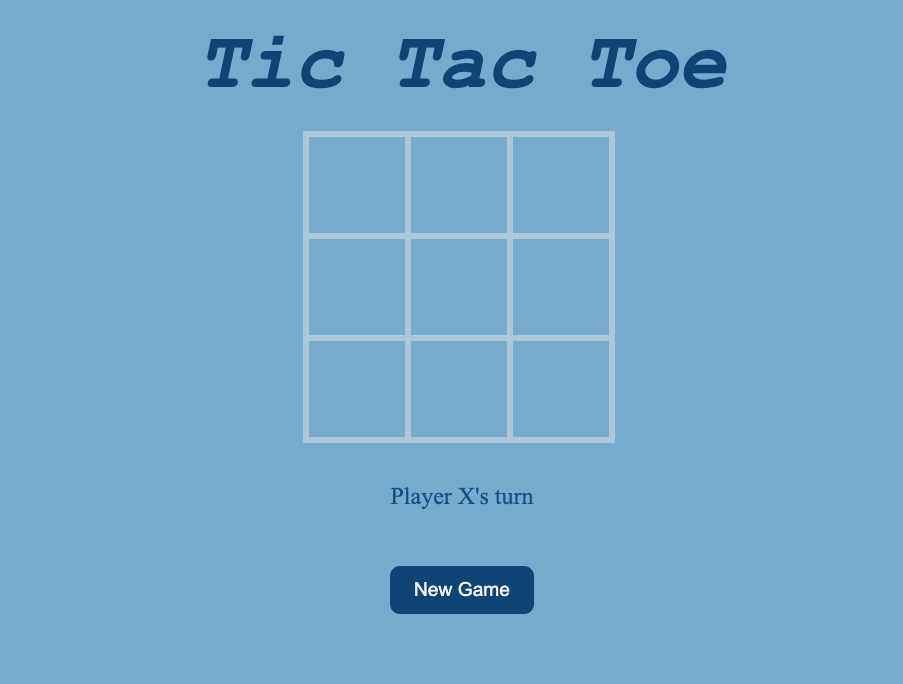

# TIC TAC TOE GAME!

#### Click the link to play! [Tic Tac Toe](http://127.0.0.1:5500/Project-1/index.html)

## Description
This game is played on a  3 by 3 grid. This is a two player game. Player X and Player O. To win the game first player needs to attempt to get 3 marks in a row. The game will show if it's player O or player X's turn. At the end, it shows which player has won the game. If all spaces are filled, the game ends in a draw. To learn more about Tic-Tac-Toe click the link. [Tic Tac Toe](https://en.wikipedia.org/wiki/Tic-tac-toe)

## Technologies Used
HTML5,
CSS, and
JavaScript
 
### Installation Instructions
Clone the Repositorie and open the Index.HTML file

### Unsolved Problems
I wanted to add a 30 second timer to the game. I also wanted to have the players names scores displayed. Moving forward, I would definitely work on that to make the game more creartive. 

 ### Wire Frame

#### Acknowledgments:
[Fonts](https://www.w3.org/Style/Examples/007/fonts.en.html),
[Stackoverflow](https://stackoverflow.com/),
[Mmdn](https://developer.mozilla.org/en-US/docs/Learn).